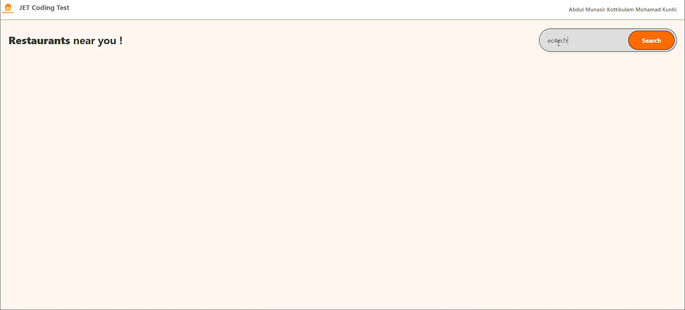

# JET Early Career Coding Assessment - Abdul Munasir

A React-based web application that allows users to search for restaurants by postcode. The app displays restaurant information including ratings, cuisines, and addresses in an elegant, user-friendly interface.



## Architecture & Design Choices

### Component Structure
The application follows a modular, component-based architecture with clear separation of concerns.


### State Management
- Given the scope of this project, state was managed using React's builtin hooks like useState, with data passed as props directly from main component, avoiding need for an external library.

### Data Transformation
- Raw API data is transformed in `dataTransforms.js` to standardize the format
- Address data is concatenated from nested objects
- Ratings display stars if count > 0, otherwise show "N.A."
- Cuisines are formatted as a comma-separated string

### API Integration
- Restaurant data is retrieved from `https://uk.api.just-eat.io/discovery/uk/restaurants/enriched/bypostcode/{postcode}`.
- Since the API blocks cross-origin browser requests (CORS), a Vite development proxy is used to forward requests server-side and avoid CORS restrictions during development.
- Includes basic error handling, logging issues to the console and displaying a fallback UI when no results are found.

## Features

- Search restaurants by postcode
- Display information of first 10 restaurants (name, address, rating, cuisines)
- Loading spinner during API calls
- Empty state message when no restaurants found
- Comprehensive unit tests for data transformation logic

## Tech Stack

- **React 19.2**: UI library
- **Vite 8.0**: Build tool and dev server
- **Vitest**: Unit testing framework
- **CSS3**: Styling with custom animations

## Installation & Setup

### Prerequisites
- Node.js 16+ installed
- npm or yarn package manager

### Steps

1. **Clone the repository**
   ```bash
   git clone https://github.com/munasirkm/Jet.git
   cd Jet/findFood
   ```

2. **Install dependencies**
   ```bash
   npm install
   ```
## Running the Application

### Development Server
Start the development server with hot module replacement:

```bash
npm run dev
```

The application opens at `http://localhost:5173` (default Vite port).


## Running Tests

Run all unit tests with verbose output:

```bash
npm test
```

### Test Coverage
- **dataTransform.test.js**: Includes unit tests for data transformation logic
  - Tests with complete data
  - Edge cases: missing address fields, empty address
  - Rating handling when count = 0
  - Cuisine formatting with empty arrays
`


## Assumptions Made

1. **Postcode Validation**: Front-end assumes backend to validate postcodes; no client-side validation implemented

2. **Invalid postcode**: Empty restaurant list with an OK status are expected 

3. **Browser Support**: Modern browsers with ES6+ support assumed


## Future Enhancements

- Pagination or infinite scroll for more results
- Filters (cuisine)
- Sorting options (by rating,)

